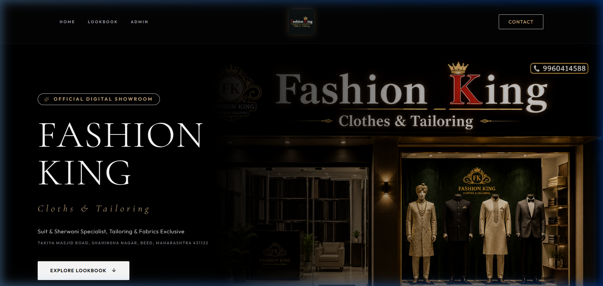
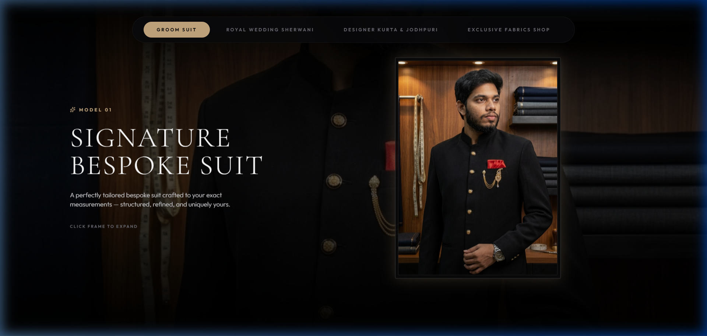
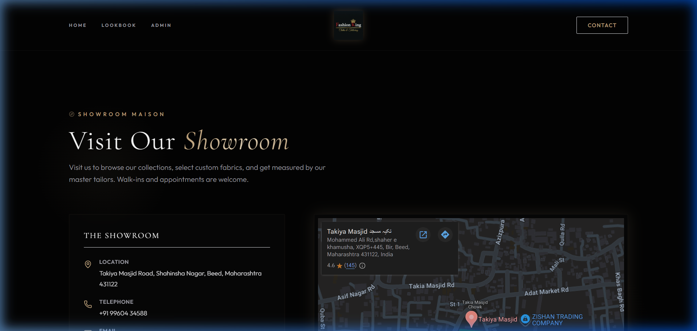

# Atelier CMS / Bespoke Web ✦

A dynamic, white-label e-commerce showcase, digital lookbook, and CMS built for luxury tailor houses, couture brands, and bespoke retail.

---

## 📸 Screenshots

| Landing Showroom | Digital Lookbook Grid |
|---|---|
|  |  |

| Contact & Boutique Details |
|---|
|  |

---

## ✨ Highlights

- **Multi-Tenant / Multi-Client Architecture**: Instantly switch client themes, branding, catalogs, and media assets using standard environment variables (`VITE_ACTIVE_CLIENT`).
- **Hybrid Data Engine**: Operates seamlessly with **Supabase** live database OR zero-config **Local Fallback Mode** (reads static config & mutates `localStorage`).
- **Luxury Aesthetic**: Dark charcoal palette (`#030303`), gold accents (`#C5A880`), glassmorphism, and smooth Framer Motion micro-animations.

---

## ⚡ Quick Setup

### 1. Clone & Install
```bash
git clone https://github.com/zeeshanbage/luxury-cms-for-shop.git
cd luxury-cms-for-shop
npm install
```

### 2. Environment Configuration
Create a `.env` file in the root directory:
```env
VITE_ACTIVE_CLIENT=fashionking
# Optional: Supabase for live DB
# VITE_SUPABASE_URL=https://your-supabase-url.supabase.co
# VITE_SUPABASE_ANON_KEY=your-anon-key
```

### 3. Run Locally
```bash
npm run dev
```
Open **`http://localhost:5173`** in your browser.

---

## 🛠 Tech Stack

- **Frontend**: React 19 + TypeScript + Vite
- **Styling**: TailwindCSS (v3) + Vanilla CSS Glassmorphism
- **Animations**: Framer Motion
- **Database**: Supabase JS Client (with Local Storage fallback)
- **Icons**: Lucide React
